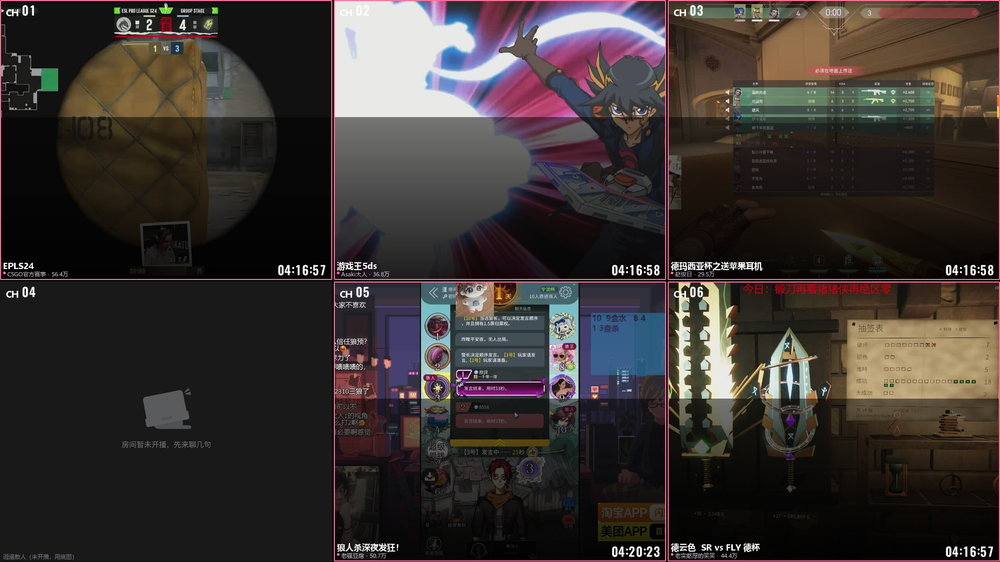

# B 站直播监控墙

像硬盘录像机那样，把一堆 B 站直播间的画面铺成宫格盯着看：在播的显示实时画面截图 + 直播标题，没在播的就用 `statics/player-bg.png` 那张「房间暂未开播」打底。



> 上面这张是按监控页同样的布局数学、拿真实抓到的直播截图合成的**像素级示意**（3×2，为了多塞几个房间进去），用来看间距 3px、圆角 2px 的效果。它不是浏览器截图，实际字体渲染请以页面为准。
>
> 开箱默认是 **2×2**：4 个内置房间正好铺满，而且 16:9 的屏幕上 2×2 的窗口比例正好也是 16:9，直播画面一点都不会被裁。

- **监控画面** `http://127.0.0.1:8848/` —— 一个全屏宫格页面，没有菜单、没有按钮、没有滚动条。
- **配置后台** `http://127.0.0.1:8848/admin` —— 房间增删排序、宫格行列、两套刷新节奏、界面叠加项，全在这里调。

---

## 快速开始

### 方式一：免安装版（不需要装 Python）

到 [Releases](https://github.com/bilibili33/bili-live-wall/releases) 下载最新的 `bili-live-wall-v*-win64.zip`，解压，双击里面的 `bili-live-wall.exe` 就行。

> 整个文件夹一起解压，**别只把 exe 拖出来**，`_internal` 是它的运行库。
> 首次运行 Windows 可能弹「已保护你的电脑」（因为没买代码签名），点「更多信息」→「仍要运行」。
> 画面拉不到就双击跑一下 `bili-live-wall.exe --selftest`，见下文[排查](#排查为什么只有状态没有画面)。

### 方式二：源码运行

**不需要 `pip install` 任何东西**，只用 Python 标准库（开发环境 3.14，3.9 以上应该都能跑）。

```
git clone https://github.com/bilibili33/bili-live-wall.git
cd bili-live-wall
```

然后双击 **`start.bat`**（会自动打开监控页），或者：

```
python main.py
python main.py --port 9000 --no-browser     # 换端口 / 不自动开浏览器
```

### 都一样的部分

- 首次运行会自动生成 `config.json`，里面已经预置了 4 个直播间，直接就能看。
- 免安装版的 `config.json` 和 `data\` 生成在 **exe 旁边**；源码版生成在**项目目录**里。
- 不碰注册表也不写 `%APPDATA%`——**不想要了整个文件夹删掉就干净了**。
- 两种方式用的是同一份代码，行为完全一致。

---

## 两个页面

### 监控画面 `/`

- 纯宫格，**没有全局标题、没有按钮、没有滚动条**。
- 每个窗口：截图铺满（`object-fit: cover`，等比放大后居中裁切，不拉伸）；直播中的窗口有 B 站粉色描边 + 底部渐变上压着直播标题、主播名、人气。
- 左上角 `CH01`… 通道号，右下角 `HH:MM:SS` 截图时间，都是 DVR 那种 OSD 味道，用 `statics/` 里那套 0-9 数字图片画的。
- 未开播的窗口：`player-bg.png` 压暗铺底，左下角显示主播名。
- 双击页面 = 全屏（再双击或 Esc 退出）。
- 想临时试布局，地址后面加参数即可，不用改配置：`/?cols=4&rows=4`、`?gap=0`、`?radius=0`、`?fit=contain`。

### 配置后台 `/admin`

四个标签页：

| 标签 | 内容 |
| --- | --- |
| 运行状态 | 每个房间的在播状态、标题、人气、最后截图时间、抓取次数、报错；以及各路径和素材是否齐全 |
| 房间管理 | 粘贴直播间链接 / 空间链接 / 房间号 → 解析 → 添加；改名、启用停用、上下移排序、删除；一键「按房间数自动排布行列」 |
| 参数设置 | 表单由后端 schema 生成，**后端每一个可调项都会出现在这里**（启动时还会自检，漏项会在日志里报错） |
| 日志 | 状态刷新、开播下播、截图、报错，每 3 秒自动滚动 |

---

## 截图是怎么来的（为什么没用无头浏览器）

B 站的 `get_status_info_by_uids` 接口会顺带返回 `keyframe` 字段，也就是**直播间当前画面的关键帧图**（1280×720 JPEG，几十 KB）。所以截图这件事完全不需要浏览器，一个 HTTPS GET 就够。

`chrome-headless-shell` + `chromedriver` 那套我也试过，最后没用，原因有三个：

1. **成本差两个数量级。** 关键帧是几十毫秒、几十 KB 的 HTTP 请求；无头浏览器是每个房间一个 Chrome 进程，2~5 秒、几百 MB 内存。房间一多就完全不是一个量级。
2. **它不一定跑得起来。** 我在 DSH 沙箱里试的时候直接崩：`mojo/platform_channel.cc: Check failed: 拒绝访问 (0x5)`——沙箱不允许程序开命名管道；`--single-process --no-zygote`、`--headless=old` 都一样。也就是说换环境就可能踩坑，而 HTTP 请求哪儿都能跑。
3. **它并没有更"实时"。** 见下面实测。

**代价也要说清楚：关键帧不是视频流，它更新得不快。** 我连续观察了 6 分钟，三个在播房间的画面内容更新间隔分别是：

```
uid=8739477 : 2 张，间隔 54 秒
uid=4578433 : 2 张，间隔 11 秒
uid=66556492 : 3 张，间隔 53 秒、268 秒
```

也就是**大约 10 秒到 4 分钟才换一张**，不是每秒都在动。所以截图间隔默认 30 秒就够了（`capture.interval`），再小只是白跑请求；后台默认开了「画面没变就不刷新」，内容一样时不会重写文件，画面也不会无谓闪动。

如果你想要"真正的实时画面"（浏览器里正在播放的那一帧，还能带弹幕），那只能上无头浏览器，而且得在沙箱外跑。抓取逻辑集中在 `app/workers.py` 的 `CaptureWorker` 里，加一种 `method` 分支不难，欢迎 PR。

---

## 架构

状态监控和截图是**两个完全独立的线程**，各有各的节奏，互不阻塞：

```
StatusWorker  ──每 15 秒──▶  get_status_info_by_uids（一次请求拿回所有房间）
                              在播状态 / 标题 / 人气 / 主播名 / 封面
                              开播的瞬间会顺手叫醒截图线程先抓一张

CaptureWorker ──每 30 秒──▶  自己再取一次关键帧地址（不依赖状态线程的结果）
                              下载 → 内容变了才原子替换写盘
```

- 关键帧地址由截图线程自己获取，所以状态线程卡住、被禁用、间隔调得很小，都不影响截图节奏。
- 写盘是「先写 `.tmp` 再 `os.replace`」，HTTP 端永远读不到半个文件。
- 前端只轮询 `/api/state`，图片 URL 里带内容版本号 `?r=N&b=<启动标记>`，所以浏览器可以放心长缓存，只有画面真的变了才会重新下载。
- 房间重新开播时，上一场的旧画面不会被当成新画面显示（按 `live_time` 区分场次），在那之前显示底图。

---

## 排查：为什么只有状态、没有画面？

如果接口通（能显示标题）但一张关键帧都拉不到，**先怀疑根证书**：

```
api.live.bilibili.com  →  GlobalSign GCC R3  DV TLS CA 2020    ← 老根
i0/i1/i2.hdslb.com     →  GlobalSign GCC R46 DV TLS CA 2025    ← 新根
```

接口和图片 CDN 的证书链挂在**两个不同的根**上。目标机器的系统根证书库偏旧（关过 Windows Update、LTSC 版、长期离线、精简系统）时，就会精准地表现为「状态能拉到、图一张都拉不到」。

所以本项目内置了一份 CA 包（`certs/cacert.pem`，来自 [certifi](https://github.com/certifi/python-certifi)，121 个 Mozilla 根证书），并把它和系统库**并集**使用（`app/tls.py`）——既不放弃系统库，也不依赖它的新鲜度。自检里会明确告诉你系统库认不认得出这些域名。

### 一条命令定位问题

```
bili-live-wall.exe --selftest        # 源码方式：python main.py --selftest
```

它会把 DNS 解析、TCP 连接、TLS 握手与证书链、B 站接口、图片 CDN（i0/i1/i2 各试一遍，还试了带/不带 Referer）、截图目录写盘全部测一遍，并把报告存成 `data\selftest-日期时间.txt`。出问题时把那个文件发出来就行。

### 平时也会一直记日志

控制台默认 `debug` 级别，每一次 HTTP 请求、每个房间的截图结果都会打出来，例如：

```
18:32:05 DEBUG [api] GET https://api.live.bilibili.com/room/v1/Room/get_status_info_by_uids?... → 200 3026B application/json 0.20s
18:32:05 DEBUG   房间 uid=730732 瓶子君152 直播中 人气=380590 关键帧=有 标题='上海冠军赛 G2打100T'
18:32:05 DEBUG   截图 uid=730732 瓶子君152 ← https://i0.hdslb.com/bfs/live-key-frame/keyframe1008173000...jpg
18:32:05 DEBUG [图片] GET https://i0.hdslb.com/bfs/live-key-frame/keyframe1008173000...jpg → 200 76218B image/jpeg 0.28s
18:32:05 DEBUG   画面已更新（74 KB，image/jpeg，0.28s）
```

同一份内容也会写进 `data\bili-live-wall.log`（超过 5MB 自动轮转）。级别可以在配置后台的「服务 → 控制台日志级别」里调，或者用 `--log-level info`。

失败时会把**原因翻译成人话**再打出来，比如：

```
18:32:05 ERROR [图片@i0.hdslb.com] GET https://... 失败：TLS 证书校验失败（可能是这台机器的根证书不全、系统时间不对，或者中间有抓包/代理软件在替换证书）
18:32:05 ERROR [图片@i0.hdslb.com]   底层错误：SSLCertVerificationError: [SSL: CERTIFICATE_VERIFY_FAILED] ...
18:32:05 WARN  [图片] 全部尝试失败：i0.hdslb.com: TLS 证书校验失败；i1.hdslb.com: TLS 证书校验失败
```

图片下载会自动依次尝试 `i0` / `i1` / `i2` 三个 CDN 域名，遇到 403 还会去掉 Referer 再试一次——所以某个 CDN 节点抽风也不会全军覆没。

---

## 自己打包免安装版

```
python -m pip install pyinstaller
build.bat
```

产物在 `dist\bili-live-wall\`（**onedir**，不是单文件：单文件每次启动都要把 20MB 解压到临时目录，慢且更容易被杀软盯上）。打包配置在 `bili-live-wall.spec`，里面把网页、素材和内置 CA 包打进 `_internal`，而 `config.json` 和 `data\` 仍然落在 exe 旁边——所以打包版和源码版行为一致。

发版时把 `packaging\使用说明.txt` 和 `LICENSE` 一起放进 zip 根目录即可。

---

## 目录结构

```
main.py                  启动入口
start.bat                双击启动（源码方式）
build.bat                双击打包 exe
bili-live-wall.spec      PyInstaller 打包配置
config.json              所有配置（首次运行自动生成，已被 .gitignore 忽略）
app/
  config.py              默认值、类型与范围校验、读写
  bili.py                B 站接口客户端 + 链接/房间号解析 + 图片 CDN 换机重试
  tls.py                 内置 CA 包 + 系统根证书库的并集校验
  logging_.py            控制台 / 日志文件 / 内存缓冲三处一起写
  selftest.py            --selftest 自检
  state.py               内存状态、状态缓存
  workers.py             状态线程 + 截图线程
  runtime.py             把上面这些串起来
  server.py              HTTP 路由
  paths.py               区分"只读资源"和"用户数据"（打包后靠它）
  meta.py                后台表单元数据（与 config.SCHEMA 自检对齐）
  web/monitor.html       监控画面
  web/admin.html         配置后台
certs/cacert.pem         内置 CA 包（certifi，121 个根证书），见下文"为什么要内置 CA"
packaging/使用说明.txt    打包进 zip 给用户看的说明
data/                    运行期数据，可随时删（已被忽略）
  shots/<uid>.jpg        每个房间当前画面
  state.json             上次状态缓存（重启后先显示旧画面）
  bili-live-wall.log     运行日志（超 5MB 自动轮转）
  selftest-*.txt         自检报告
statics/
  0.png ~ 9.png          数字 OSD 素材（透明底白字）
  player-bg.png          未开播底图
docs/preview-3x2.png     README 里那张示意
```

---

## 配置参数

后台里每一项都有中文说明，这里只挑几个容易踩坑的：

| 参数 | 说明 |
| --- | --- |
| `grid.cols` / `grid.rows` | 宫格行列，默认 2×2。**窗口数 = cols × rows**，房间比窗口多的话多出来的不显示（后台会提示）。 |
| `grid.gap` / `grid.radius` | 默认 3px / 2px，就是硬盘录像机那种几乎贴在一起的感觉。 |
| `grid.fit` | `cover` 铺满并裁切（默认，不拉伸）；`contain` 完整显示留黑边。 |
| `status.interval` | 状态刷新间隔，默认 15 秒。这个请求很轻，可以小。 |
| `capture.interval` | 截图间隔，默认 30 秒。建议 ≥ 关键帧的实际更新速度。 |
| `status.cookie` | 一般留空。遇到风控或需要登录态时，填 `SESSDATA=xxx; bili_jct=xxx`（注意 `config.json` 已被 git 忽略，不会误传）。 |
| `ui.*` | 标题/主播名/人气/状态点/通道号/时间戳显示与否、标题字号、未开播压暗程度、直播中描边颜色与粗细、OSD 缩放。 |
| `assets.fallback_image` | 未开播底图，相对路径按项目根目录解析，也可以写绝对路径。 |
| `server.host` | 默认 `127.0.0.1` 只有本机能访问；想给局域网其它设备看就改 `0.0.0.0`（没有鉴权，自己把握）。 |

### 关于裁切（想让画面不被裁，让行列数相等）

屏幕是 16:9 时，**行列数相等**（2×2、3×3、4×4）窗口比例正好也是 16:9，直播画面一点都不会被裁；3×2 这种窗口比例是 1.19，会裁掉左右各约 25%。默认给了 2×2，你房间数变了可以直接点后台的「按房间数自动排布行列」。

---

## HTTP 接口

给二次开发留的（后台页面自己也在用）：

| 方法 | 路径 | 说明 |
| --- | --- | --- |
| GET | `/api/state` | 所有房间的当前状态 + 画面 URL + 布局/界面配置 |
| GET | `/api/config` | 配置、默认值、后台表单元数据、各路径体检结果 |
| POST | `/api/config` | 保存配置（自动做类型与范围校验，超范围的夹到边界并回提示） |
| POST | `/api/rooms/resolve` | `{"input": "链接或房间号"}` → 解析出 uid / room_id / 主播名 |
| POST | `/api/refresh` | 立刻跑一轮状态刷新和截图 |
| POST | `/api/test` | 测一下接口连通性 |
| GET | `/api/log?limit=N` | 运行日志 |
| GET | `/shots/<uid>.jpg` | 某房间当前画面（文件不存在时返回底图） |
| GET | `/assets/fallback.png`、`/assets/digits/<0-9>.png` | 素材 |

---

## 已知限制

- **需要能访问 `api.live.bilibili.com`**。断网时保留最后一次状态，超过 `status.stale_after` 会标记「数据陈旧」，前端轮询失败两次会在右上角亮一个小红点。
- 关键帧更新慢（见上），画面是"每隔一会儿换一张"，不是视频。
- 房间被隐藏 / 已注销时接口不返回该房间，后台会显示对应报错。
- 服务本身没有鉴权，别直接暴露到公网。
- 配置里改端口需要重启服务（后台会提示），其它参数都是即时生效。

---

## License 与免责

代码部分是 [MIT](LICENSE)。

`statics/player-bg.png` 是哔哩哔哩直播间的「房间暂未开播」占位图，版权归哔哩哔哩所有，随仓库提供只是为了开箱即用。本项目与哔哩哔哩无任何关联，仅供个人查看自己关心的直播间使用，请勿用于商业用途。
